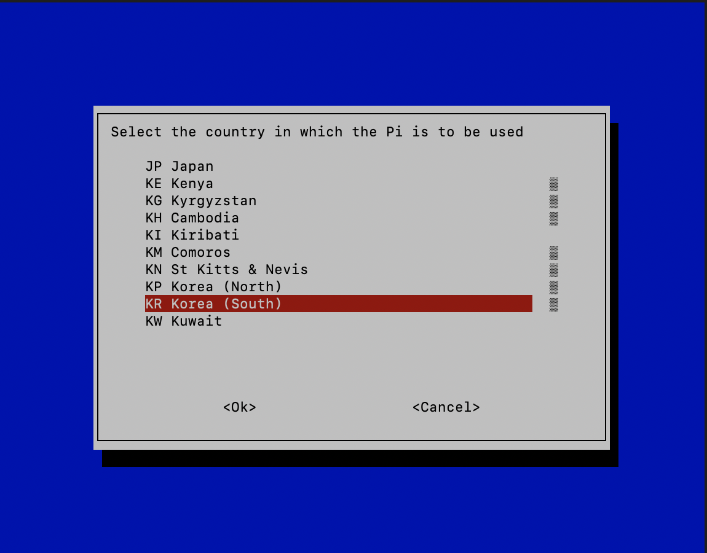
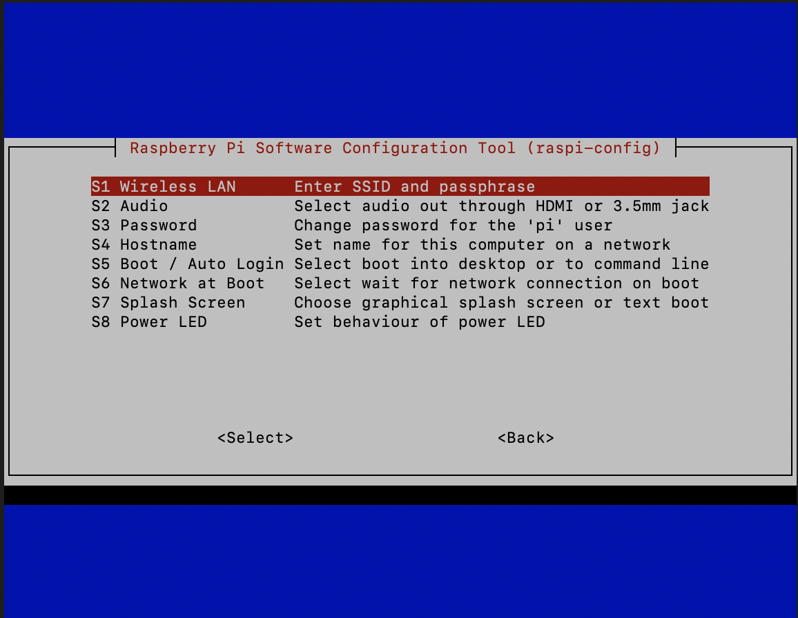
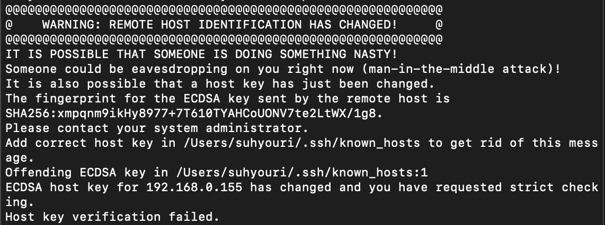

# B1. 라즈베리 파이 로컬 셋업
--------------
1. 패스워드 바꾸기 (1. system option-> 3. Password) - 1234
2. 와이파이 셋팅하기 (1. System option -> 1. Wireless LAN -> 연결되어 있는 wifi이름입력) 
  https://www.raspberrypi.org/documentation/configuration/wireless/wireless-cli.md

    * 접속가능한 와이파이 체크  
       `$ sudo iwlist wlan0 scan`

    * 국가 설정해주기 (5. Localisations on Options -> L4. WLAN Country → 한국으로 해줘야됨 ! 1-4 KR korea(South) )
   
    * SSID(ex.iptime) / SSID PW 설정하기
    
    * 셋팅 됐는지 확인해주기(연결된 와이파이체크)  
       `$ sudo nano /etc/wpa_supplicant/wpa_supplicant.conf`
    * 와이파이 연결 테스트하기  
       `$ ping 8.8.8.8`
    * 안되면 reboot 하기  
       `$ sudo reboot`
    * 내 ip 확인  
       `$ ifconfig`  
       ssh server(3. Interface Option -> P2. SSH -> enabled (독일에 있음(원격이 되는 최소한의 조건 완성))-> 서버 열어주기

--------------
# B2. 라즈베리 파이 원격 셋업
--------------
    Terminal 열어서 
1. ssh 라즈베리파이 아이디+라즈베리파이 local주소  
         ex) ssh pi@192.168.0.155
2. 엔터 → 라즈베리 파이 비밀번호 치기 (원격이 되는 최소한의 조건 완성, 내컴에서 ssh 서버로 들어간 거)  
   * 에러 발생 가능성
   

   * 해결  
  `$ ssh-keygen -R 서버이름 또는 IP주소`
3. 구성되어 있는 리눅스 업데이트 해주기  
   https://www.raspberrypi.org/documentation/raspbian/updating.md  
   `sudo apt update`
4. 업그레이드  
    `sudo apt full-upgrade`
