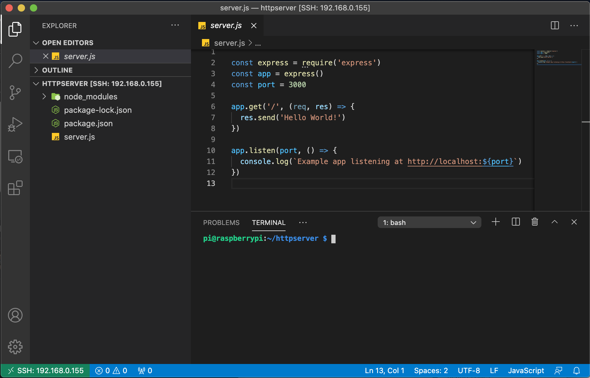
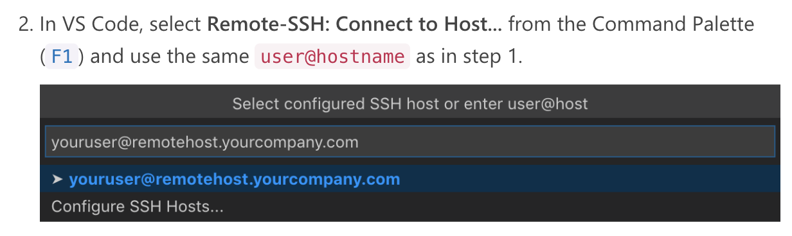

Raspberry Pi Install & Setup
============================

C1. 라즈베리파이에 최신 nodejs 설치하기
--------------------------------
* 참고 : <https://github.com/nodesource/distributions>
```
``` 

1. 앞선단계에서 한 OS 최신 업데이트 중요 
   * ```$ sudo apt update``` & ```$ sudo apt full-upgrade```
2. node js 깔아주기
   * ```$ curl -fsSL https://deb.nodesource.com/setup_lts.x | sudo bash -```
   * ```sudo apt install -y nodejs```
3. node js, npm 버젼 확인하기
   * ```node -v```
   * ```npm -v```

C2. Node http 서버 띄우기
-----------------------
1. 디렉토리 만들기
   * ```$ kdir httpserver```
   * ```$ cd httpserver```
2. ```$ npm init```(opt.실행파일 이름은 server.js로)
3. ```$ npm i express```
4. server.js 파일 만들어 작성하기
    ```$ sudo nano server.js```
    * server.js 코드 작성
<pre>
<code>
const express = require('express')
const app = express()
const port = 3000
app.get('/', (req, res) => {
res.send('Hello World!')
})
app.listen(port, () => {
console.log(`Example app listening at http://localhost:${port}`)
})
</code>
</pre>
5. 실행
   * ```$ node server.js```
  
C3. VS 코드로 라즈베리 파이에 연결하기
------------------------------
* 참고: <https://code.visualstudio.com/docs/remote/ssh>
1. vs code 에서 remote development 익스텐션 깔아주자
2. f1을 누르고 Remote-SSH: Connect to Host를 누르고 Piusername@ipAdree (예.pi@192.168.0.155)치고, 엔터를 누른다 
    
3. rasberry pi의 password 입력-> 접속
   (참고 : vscode terminal = terminal)
    
4. VSCode에서 ssh로 rasberryPi 연결한 뒤에, vscode에 파일 내용 변경 시, 저장하면 권한 없다고 할 때, username으로 소유자를 변경해주기 ```$ sudo chown -R username  *```

